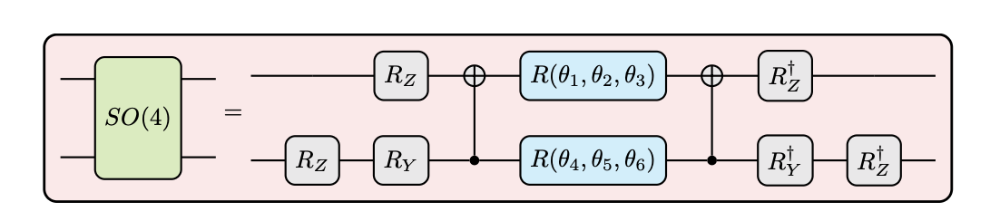
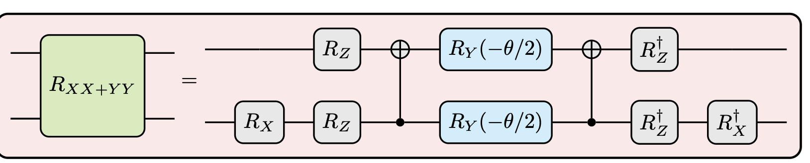

# Schwinger Model Simulation with VQE

This repository contains a Jupyter Notebook, **`Simulation.ipynb`**, implementing a numerical simulation of the Schwinger model using the Variational Quantum Eigensolver (VQE) algorithm. The implementation follows and extends the methodology presented in [1].

## Scientific Overview

The Schwinger model is a (1+1)-dimensional version of quantum electrodynamics (QED) describing massive Dirac fermions interacting via a U(1) gauge field. Despite its lower dimensionality, it exhibits non-trivial quantum field theoretic features such as confinement and chiral symmetry breaking, making it a paradigmatic testbed for quantum simulation.

This project focuses on approximating the ground state energy and associated observables of the discretized Hamiltonian using a quantum–classical hybrid approach.

The workflow includes:
- Derivation of the discretized Hamiltonian using Wilson’s formulation.
- Mapping fermionic operators to Pauli operators via the Jordan–Wigner transformation.
- Construction of variational ansatz circuits.
- Application of the VQE algorithm to estimate the ground state.
- Reliability assessment through:
  - Exact diagonalization of the Hamiltonian for small system sizes.
  - Fidelity comparison between the exact lowest-energy eigenstate and the variational state obtained from the optimized ansatz.

## Mathematical Framework

Starting from the gauge-invariant Lagrangian density

$$
\mathcal{L} = \bar{\psi}(i\gamma^{\mu}D_{\mu} - m)\psi,\qquad D_\mu = \partial_\mu + ig A_\mu
$$

and working in temporal gauge $(A_0 = 0)$, the Hamiltonian density of the Schwinger model becomes

$$
\mathcal{H} = -i  \bar{\psi}\gamma^{1}(\partial_1 + ig A_{1})\psi + m  \bar{\psi}\psi.
$$

Including the topological $\theta$-term, the Hamiltonian density becomes

$$
\mathcal{H} = -i \, \bar{\psi}\gamma^{1}(\partial_1+igA_{1})\psi
+ m \, \bar{\psi}\psi
+ \tfrac{1}{2}\left(\partial_0 A_1 + \tfrac{g\theta}{2\pi}\right)^2
$$

which in integral form reads

$$
H = \int dx \, \mathcal{H}
= \int dx \Big[
 -i\bar{\psi}(x)\gamma^{1}(\partial_1+igA_{1})\psi(x)
 + m \, \bar{\psi}(x)\psi(x)
 + \tfrac{1}{2}\Big(\partial_0 A_1 + \tfrac{g\theta}{2\pi}\Big)^2
\Big].
$$

---

### Wilson discretization and spin formulation

On a lattice with open boundary conditions, Wilson’s formulation yields the discretized Hamiltonian

$$
H_W =
\sum_{n=0}^{N-2} \bar{\phi}_n \Big( \tfrac{r+i\gamma^1}{2a} \Big) U_n \phi_{n+1} + \text{h.c.}
+ \sum_{n=0}^{N-1}\Big(m_{\text{lat}}+\tfrac{r}{a}\Big)\bar{\phi}_n\phi_n
+ \sum_{n=0}^{N-2} \tfrac{a g^2}{2}\Big(L_n + \tfrac{\theta}{2\pi}\Big)^2
$$

After applying the Jordan–Wigner transformation, the fermionic model is mapped to a spin Hamiltonian

$$
W_W = x \sum_{n=0}^{N-2}(X_{2n+1}X_{2n+2}+Y_{2n+1}Y_{2n+2})
+ (\frac{m_{\text{lat}}}{g}\sqrt{x}+x)
\sum_{n=0}^{N-1}\Big(X_{2n}X_{2n+1}+Y_{2n}Y_{2n+1})
+ \sum_{n=0}^{N-2}\Big(\tfrac{\theta}{2\pi}+\sum_{k=0}^{n}Q_k)^2
$$


with

$$
Q_k = \tfrac{1}{2}(Z_{2k}+Z_{2k+1}), \qquad x = \frac{1}{(ag)^2}.
$$

The electric field operator in spin representation is

$$
L_W = \tfrac{\theta}{2\pi} + \tfrac{1}{2}\sum_{k=0}^{\lceil N/2 \rceil -1}(Z_{2k}+Z_{2k+1}).
$$

## Variational Quantum Eigensolver (VQE)

The VQE algorithm minimizes the expectation value

$$
E(\vec{\theta}) = \langle \psi(\vec{\theta}) \vert \, W_W \, \vert \psi(\vec{\theta}) \rangle,
$$

where the variational state is prepared as

$$
\vert\psi(\vec{\theta})\rangle = U_V(\vec{\theta})\,U_R\,\vert 0\rangle.
$$

Two different ansatz circuits are implemented and benchmarked:

**SO(4) ansatz**



**$R_{XX+YY}$ ansatz**



The notebook checks the reliability of the method by:
- Exact diagonalization of the Hamiltonian for small systems.
- Computing the fidelity between the exact lowest-energy eigenstate and the variational state obtained from VQE.

## Repository Structure

```
├── Simulation.ipynb   # Main notebook containing the implementation
├── requirements.txt   # Dependencies for running the notebook
└── README.md          # Project documentation
```

## Requirements

Dependencies are listed in `requirements.txt`. Install them with:
```bash
pip install -r requirements.txt
```

## Usage

1. Install dependencies:
   ```bash
   pip install -r requirements.txt
   ```
2. Launch the notebook:
   ```bash
   jupyter notebook Simulation.ipynb
   ```

## Results

The notebook produces:
- Energy convergence plots for different ansatzes.
- Comparison of VQE energies with exact diagonalization results.
- Fidelity between the optimized ansatz state and the exact ground state.
- Expectation values of observables (electric field, particle number).

These results validate the capability of VQE to capture the non-trivial physics of the Schwinger model.

## Future Directions

- Scaling to larger lattice sizes beyond exact diagonalization feasibility.
- Exploration of alternative ansatz families.
- Benchmarking against other quantum algorithms (e.g., QAOA, QITE).
- Extension to higher-dimensional or non-Abelian lattice gauge theories.

## References

[1] Takis Angelides, Pranay Naredi, Arianna Crippa, Karl Jansen, Stefan Kühn, Ivano Tavernelli, Derek S. Wang, *First-Order Phase Transition of the Schwinger Model with a Quantum Computer*. arXiv:2312.12831 (2023). https://arxiv.org/abs/2312.12831
